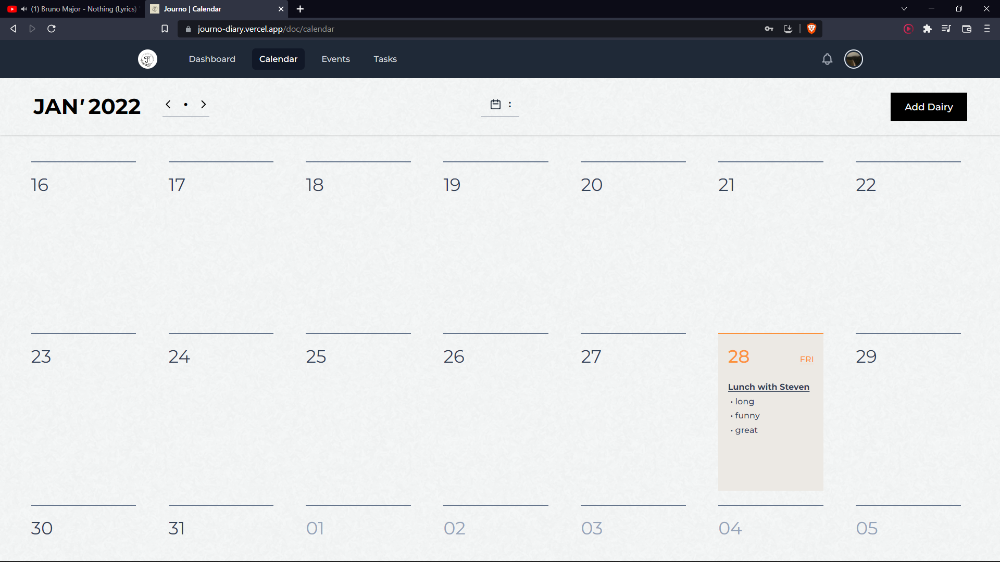

<h4>

<i>

## Getting Started
---

### 1. Using node

```bash
# Install the application dependencies
npm install

# Build the applicaion
npm run build

# Start the server
npm run start
```

### 2. Using docker

```bash
# Build the docker image
docker image build -t journo .

# Run the docker container
docker run -p 3000:3000 journo
```

Open [http://localhost:3000](http://localhost:3000) with your browser to see the result.

You can start editing the page by modifying `pages/index.tsx`.





</i>

</h4>